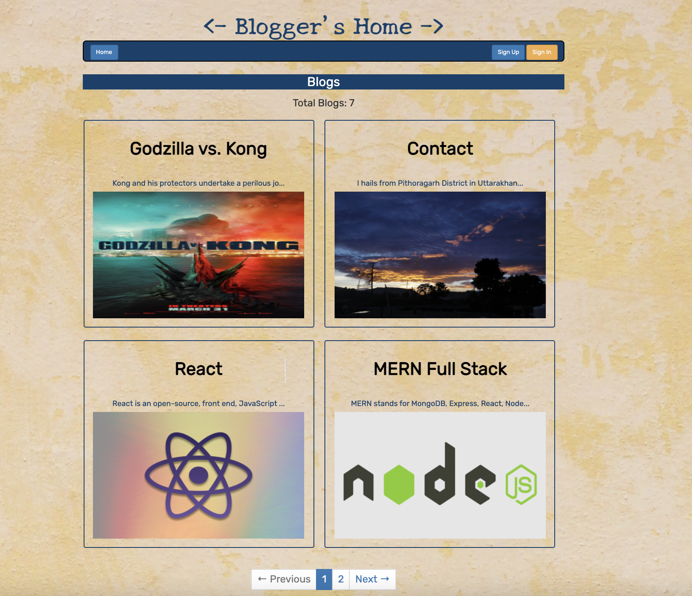
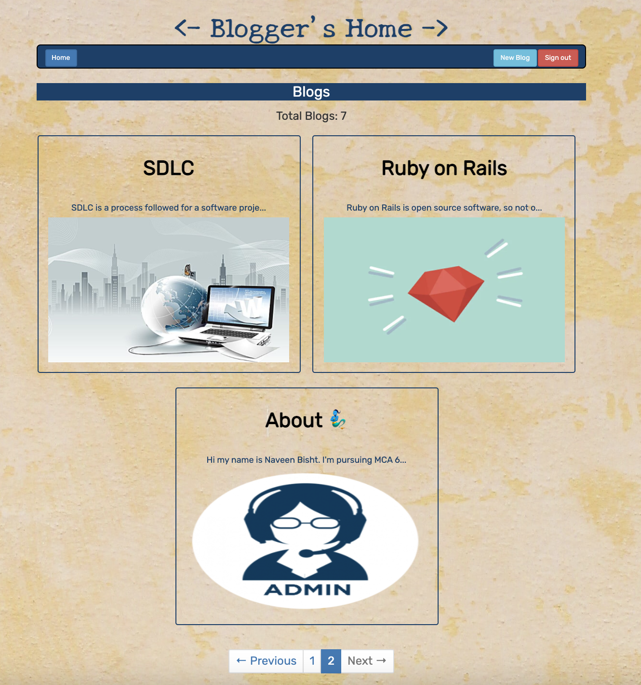
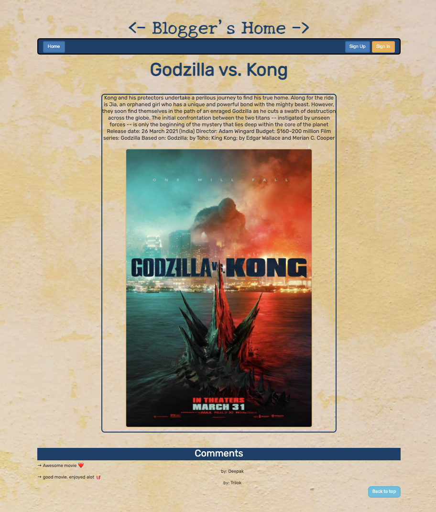
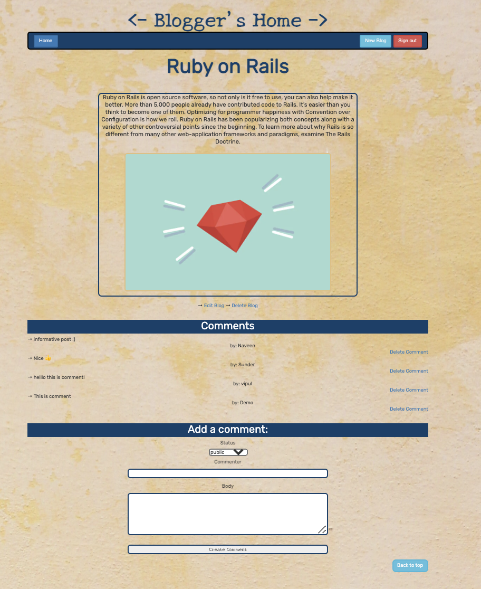
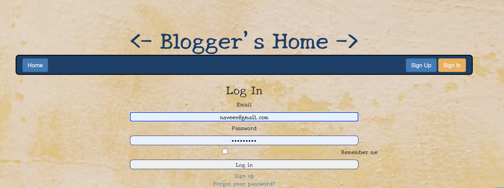
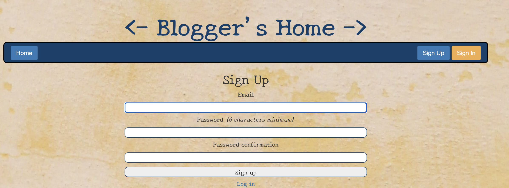
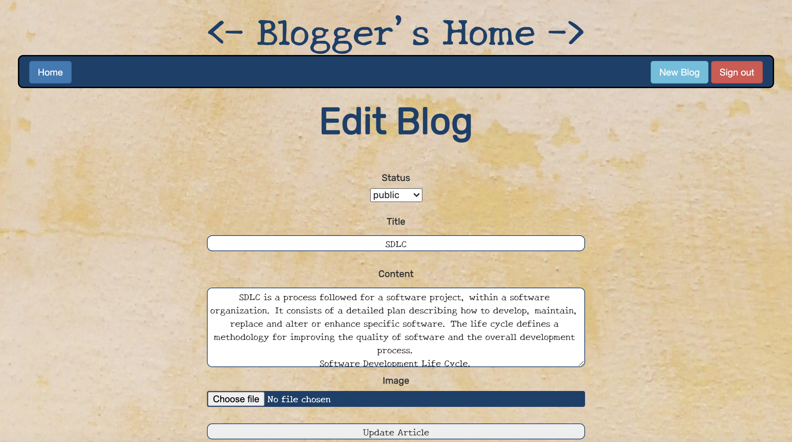
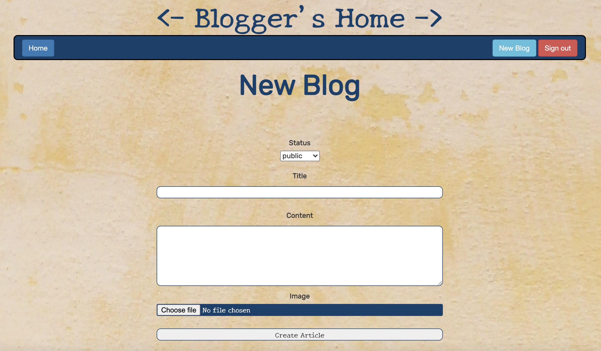

## Naveen Bisht
[![LinkedIn][linkedin-shield]][linkedin-url]

<br />
<p align="center">
  <a href="https://github.com/Naveen-Bisht/BloggersHome" target="_blank">
    
  </a>

  <h3 align="center">Blogger's Home <br/>
  Ruby on Rails
  </h3><br/>
  
</p>

## About the Project

This project is based on Blog Website which is built on top of Ruby on Rails.

## Getting Started

### Prerequisites

Technologies that are used for builting this project are:
* [Ruby on Rails](https://rubyonrails.org)
* [Node.js](https://nodejs.org/en/)
* [NPM](https://www.npmjs.com/)
* [Yarn](https://yarnpkg.com/)
* [SQLite](https://www.sqlite.org/index.html)
* [Bundler](https://bundler.io)


### Installation

1. Clone the repo
   ```sh
   git clone https://github.com/Naveen-Bisht/BloggersHome.git
   ```
2. Install packages
   ```sh
   bundle install
   ```
3. Start the server
   ```sh
   rails server
   ```
4. Runs the app in the development mode.
   ```
   Open [http://127.0.0.1:3000] or [http://[::1]:3000] to view it in the browser.
   ```

### Screenshots

1. Home - LogIn User


2. Blog View


3. Comments


4. Login


5. SignUp


6. Edit Blog


7. Create Blog


[linkedin-shield]: https://img.shields.io/badge/-LinkedIn-black.svg?style=for-the-badge&logo=linkedin&colorB=555
[linkedin-url]: https://www.linkedin.com/in/nbisht7/
